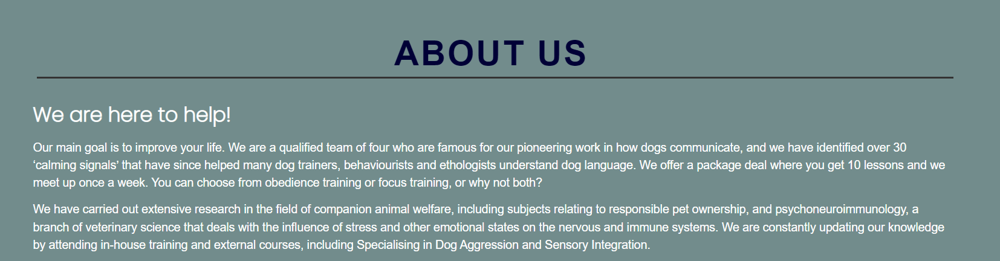
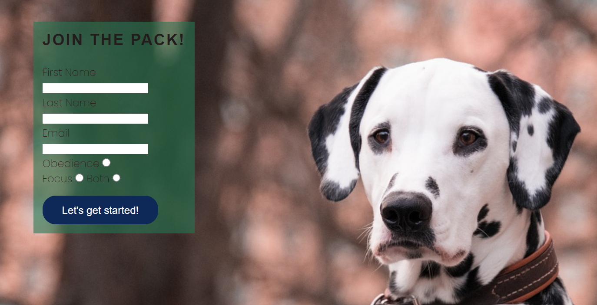

# **_How to train your dog_**

This project contains information and examples on how to best train your dog. It is vital for a strong connection between owner and dog, it provides mental stimulation and strengthens the bond. This project will provide tips and tricks to make your dog as happy as it can be. This website is not only for beginners, but also for those who want to improve their skills.

# User Experience (UX)

## User view

* As a user I want to be able to navigate through the whole site smoothly.
* As a user I want to understand the purpose of the site upon loading it.
* As a user I want to easily be able to sign up to the courses without any issues.
* As a user I want to be able to understand what the trainers ambitions are.
* As a user I want to see existing images of the training.
* As a user i want to know about the business.
* As a user i want to connect with 'How to train your dog' on social media.

# Navigation

* ### Home page 

* In the heading at the top of the page you will find the name of the website
* Beneath that one can see the navigation links which provide different sections to the same website. They are as following: Home, About us, Gallery and Sign up.
* The page continues with an image of a person holding a Husky, the Husky is looking up att the sky. At the top of the image there is an encouraging text, and it looks like the Husky is looking at it.
* Beneath the main image there are three sections of text which include why it is important to train your dog, how you can connect to each other and what your dog can gain from it.
* What follows is three images of dogs in a horizontal row 
* Lastly you will find links to different social media

* ### About us

* Here you will find the same heading and navigation links
* This time it is followed by h2 heading which explain the 'About us' section.
* The information text thoroughly explains the goal of the website and what the trainers aspires.
* A button who directs you to the sign up page can be found underneath the text
* Beaneath that there is an image of three people playing with a dog
* This page also ends with the same footer as the home page, this is where you find the different social media links.

* ### Gallery

* Here you find the same heading as before and the same navigation links which direct you to the different sections of the website.
* It is followed by several images of different dogs in different situations. 
* Lastly the page ends with the links to social media

* ### Sign up

* The start of this page provides the same information as the ones before with the same heading and navigation links.
* This page contains an image of a Dalmatian dog that is leaning against a fence.
* To the left of the image there is a box with a sign up form inside of it.
* The sign up form demands your full name and email adress and the user can choose which kind of training they would like.
* There is also a button to click when the user feels ready to provide their information to the site.
* The form requires entries in every field to be able to click the 'Let's get started!' button.

* ### Destination form

* When a user Wants to sign up to the course and they click the button which say 'Let's get started!', the user will be sent to a page which will thank them for joining.
* The page will then provide the user with a button that will send them to the home page if they click on it.
* A user can only reach this page if they sign up to the course

* ### Footer

* Lastly the page ends with the navigation to the different social media links.

# Design and layout

* ### Font

* The lettering style chosen for the sites headings is 'Roboto slab' and 'Poppins' for the body text. Both of them have a fall back of sans-serif.
* 'Roboto slab' was chosen to give a forward and direct introduction to the site.
* 'Poppins' was applied to give a soft contrast to the heading.
* The color scheme and layout that is chosen was to give the feeling of nature and wild life. The blue and green matches very well together, and most certainly they match with the nature pictures of the dogs.

## Deployment

### **To deploy the project**

The site was deployed to GitHub pages. The steps to deploy a site are as follows:
  1. In the GitHub repository, navigate to the **Settings** tab.
  2. Once in Settings, navigate to the **Pages** tab on the left hand side.
  3. Under **Source**, select the branch to **main**, then click **save**.
  4. Once the main branch has been selected, the page will be automatically refreshed with a detailed ribbon display to indicate the successful deployment.

  The live link to the Github repository can be found here - https://github.com/MollyAdamsson/Portfolio-Project-1

# Testing

* The page is tested in different browsers, such as: Chrome, Safari and Firefox
* It is easy to navigate between the sections, the media links work and opens a new tab and the form on the sign up page works.
* It is also tested and confirmed that the heading, navigation, media links and text are readable and understandable.
* It is confirmed that the page works on all media devices through the devtools device side bar.
* Different layouts for the the different media devices was tested, this was made to make sure that it looked good and that the user easily could navigate and understand. This led to the decision to remove the hero image from the smartphone device, mostly to make it look more clean and to minimize the risk of making the image look too cramped up.

### Bugs

* There has been some small issues along the way, when the code did not behave the way it was expected to and such. When that occured, the main focus was to check it via the W3C Markup Validation Service, link to the site can be found here - https://validator.w3.org/
* The problem that occured had to do with the the three boxes with inofmration that did not line up the way it should. The boxes were uneven. 
* The code was run thorugh the validator, it marked were the problem were and it was then corrected.

### Validator testing

 #### HTML:
 * No errors showed up when it passed through the validator
 #### CSS
 * No errors showed up when it passed through the validator
 #### Access
 * The fonts and color scheme matched nicely and were accessible when passed through 'Lighthouse' in devtools side bar.

# Technologies Used

* [HTML5](https://html.spec.whatwg.org/) - provides the content and structure for the website.
* [CSS](https://www.w3.org/Style/CSS/Overview.en.html) - provides the styling.
* [Gitpod](https://www.gitpod.io/#get-started) - used to deploy the website.
* [Github](https://github.com/) - used to host and edit the website.

# Credits

* The font came from [Google Fonts](https://fonts.google.com/).
* The colour palate was compiled by images and schemes in [Colormind](http://colormind.io/).
* The icons came from [Font Awesome](https://fontawesome.com/).

#### Media

* All images are taken from [Pixabay](https://pixabay.com/)

#### Content

* Some of the code were inspired by the CI Love Running project (https://github.com/Code-Institute-Solutions/love-running-2.0-sourcecode/tree/main/01-getting-set-up/02-boilerplate)

#### Acknowledgements

This website is was the main project for the Portfolio 1 Project for the Full Stack Software Developer Diploma at Code Institute [Code Institute](https://codeinstitute.net/). I would like to thank my mentor [Precious Ijege](https://www.linkedin.com/in/precious-ijege-908a00168/) for guiding me and help me with questions and worries. I would also like to take this oppertunity to thank the Tutor center at [Code Institute](https://codeinstitute.net/) for being patient and helpful when I have asked for help. 

*How to train your dog* is only a made up website based on my own interests. The passion for dogs exists, but not on a professional level.

[Molly Adamsson](https://www.linkedin.com/in/molly-adamsson-35041b231/) 2022